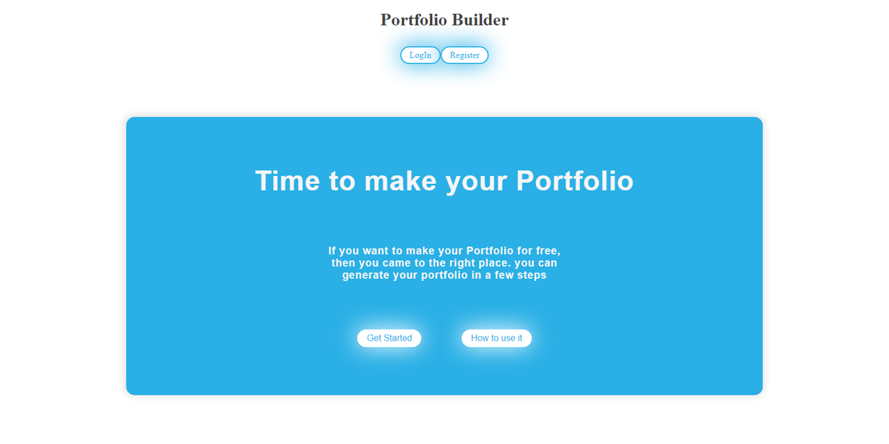

<p align="center">
  <a href="https://portfolio-builder-client.vercel.app/" title="Portfolio Builder">
    
  </a>
</p>
<h1 align="center">🌟 Portfolio Builder 🌟</h1>
<p align="center">API for React application for creating simple portfolios in just a couple of minutes using pre-built templates</p>

<p align="center">
<a href="https://github.com/Rohit19060/portfolio-builder-api/blob/master/LICENSE" title="License">

</a>
<a href="https://github.com/Rohit19060/portfolio-builder-api/fork" title="Forks">

</a>
<a href="https://github.com/Rohit19060/portfolio-builder-api/stargazers" title="Stars">

</a>
<a href="https://github.com/Rohit19060/portfolio-builder-api/issues" title="Issues">

</a>
<a href="https://github.com/Rohit19060/portfolio-builder-api/pulls" title="Pull Requests">

</a>
<a href="https://github.com/Rohit19060/portfolio-builder-api" title="Repo Size">

</a>
<a href="https://discord.gg/2wpHNSjwm2" title="Join King Tech's Community">

</a>
</p>

<p align="center" title="Portfolio Builder"></p>

<h2 align="center">🌐 Links 🌐</h2>
<p align="center">
    <a href="https://github.com/Rohit19060/portfolio-builder-client" title="Portfolio Builder Repo">📂 Repo</a>
    ·
    <a href="https://portfolio-builder-client.vercel.app/" title="Visit">✨ Live View</a>
    ·
    <a href="https://enigmatic-tundra-24310.herokuapp.com" title="Portfolio Builder API Repo">🛳 API</a>
    · 
    <a href="https://github.com/Rohit19060/portfolio-builder-api" title="Portfolio Builder API">📂 API Repo</a>
    ·
    <a href="https://github.com/Rohit19060/portfolio-builder-api/issues/new/choose" title="🐛Report Bug/🎊Request Feature">🚀 Got Issue</a>
</p>

## 🚀 Features

- **Authentication System**

- **Number of Templates**

- **Highly Customizable**

- **Easy to Use Interface**

## 🦋 Prerequisite

- Basic Understanding of [HTML](https://youtu.be/JHv2jmnrLlA "HTML - First Step Towards Web Development")

- Basic Understanding of [CSS](https://youtu.be/d1tP7ow7HbQ "CSS - Second Step Towards Web Development")

- Basic Understanding of JavaScript

- Basic Understanding of [Node](https://nodejs.org/ "Node")

- Basic Understanding of [NPM](https://www.npmjs.com/ "NPM")

- Basic Understanding of [Express](https://expressjs.com/ "Express")

## 🛠️ Installation Steps

1. Clone the repository

```Bash
git clone https://github.com/Rohit19060/portfolio-builder-api.git
```

2. Change the working directory

```Bash
cd portfolio-builder-client
```

3. Install Dependencies

```Bash
npm i
```

4. Run the app using terminal

```Bash
npm start
```

**🎇 You are Ready to Go!**

## ❗ Available Commands

In the project directory, you can run:

```Bash
npm start
```

Start the server for serving or you can say simply run an express server on a defined port for listening. I am using node and the server is defined in src/server.js file.
Perform request to get a response from it.

```Bash
npm run test
```

Launches the test runner in the interactive watch mode.

```Bash
npm run dev
```

Run the server in development mode so if you perform and change in a file you don't need to terminate the server and start again, nodemon will handle that every time you save the file.

```Bash
npm run migrate
```

Migrate Scripts to run postgrator and for creating tables in database and if required we can undo them too by provided scripts.

```Bash
npm run predeploy
```

For running a command before deploying. this command will fix all the error before deploying the app to Heroku.

```Bash
npm run deploy
```

For deploying the API endpoint to Heroku

## Schema

### Portfolio_user

```js
{
    id: {
    type:String,
    unique:true
  },
    user_name: {
    type: String,
    required: true,
    unique: true
  },
    password: {
    type: String,
    required: true,
  },
   date_created:{
    type: Date,
    default: Date.now
  },
   date_modified:{
    type: Date,
    default: Date.now
  }
}
```

### Portfolio_data

```js
{
  id: {
    type:String,
    unique:true
  },
  name: {
    type: String,
    required: true,
    unique: true
  },
   portfolio_created: {
     type: Date,
    default: Date.now
  },
  projects:{
    type: Array,
    required: true,
  },
  organization:{
     type: Array,
    required: true,
  },
  github:{
    type:String,
    required:true,
  },
  linkedin:{
    type:String,
    required:true,
  }
}
```

## API Overview

```text
/api
.
├── /auth
│   └── POST
│       └── /login
├── /users
│   └── POST
│       └── /
├── /templates
│   └── GET
│       ├── /edit
│       ├── /:token
│       └── /count
│   └── POST
│       ├── /edit
│       └── /data

```

### POST `/api/auth/login`

```js
// req.body
{
  user_name: String,
  password: String
}

// res.send
{
  authToken: String
}
```

### POST `/api/users/`

```js
// req.query
{
  user_name: String,
  password: String
}

// res.json
{
    id:String,
    user_name:String,
    date_created: Date,
 };
```

### GET `api/templates/:token`

```JS
// req.query
{
  token: JWT Token
}

// res.write
{
 Content:HTML
}
```

### GET `api/templates/count`

```JS
// res.json
{
    count:Number
}
```

### GET `api/templates/edit`

```JS
// res.json
{
    name:String,
    projects:String,
    organization:String,
    github:String,
    linkedin:String
}
```

### POST `api/templates/data`

```JS
// req.body
{
    name:String,
    projects:String,
    organization:String,
    token: JWT Token
}
```

### POST `api/templates/edit`

```JS
// req.body
{
    name:String,
    projects:String,
    organization:String,
    github:String,
    linkedin:String
    token: JWT Token
}
```

## 👷 Built with

- [Node](https://nodejs.org/en/ "Node"): as Run-time environment

- [Express](https://expressjs.com/ "Express"): as Web application framework

- [NPM](https://www.npmjs.com/ "NPM"): As Package Manager

- [JWT](https://jwt.io/ "JWT"): For Authentication

- [Mocha](https://mochajs.org/ "Mocha"): For Testing

- [Chai](https://www.chaijs.com/ "Chai"): For Testing

- [Knex.js](http://knexjs.org/ "Knex")- For interfacing with the PostgreSQL database

- [Postgrator](https://www.npmjs.com/package/postgrator "Postgrator"): For Database

## 📂 Directory Structure

> [`./src/app.js`](https://github.com/Rohit19060/portfolio-builder-api/blob/main/src/app.js "Petful"): Main Entry file

> [`./migrations`](https://github.com/Rohit19060/portfolio-builder-api/tree/main/migrations "Migrations"): All the Migrations are in this directory

> [`./src/config.js`](https://github.com/Rohit19060/portfolio-builder-api/blob/main/src/config.js "Configuration"): All the Configuration related data are in this file

> [`./scr/auth`](https://github.com/Rohit19060/portfolio-builder-api/tree/main/src/auth "Auth"): Authentication router and service are in this directory

> [`./scr/templates`](https://github.com/Rohit19060/portfolio-builder-api/tree/main/src/templates "Templates"): All the templates, router and service are in this directory

> [`./scr/users`](https://github.com/Rohit19060/portfolio-builder-api/tree/main/src/users "Users"): User router and service are in this directory

## 🎊 Future Updates

- [ ] Add Forgot Password

- [ ] Add Notification Support

## 🧑🏻 Author

**Rohit Jain**

- 🌌 [Profile](https://github.com/Rohit19060 "Rohit Jain")

- 🏮 [Email](mailto:rohitjain19060@gmail.com?subject=Hi%20from%20Portfolio%20Builder "Hi!")

- 🦁 [Website](https://kingtechnologies.in "Welcome")

<h2 align="center">🤝 Support</h2>

<h3 align="center">🎀 Contributions (<a href="https://guides.github.com/introduction/flow" title="GitHub flow">GitHub Flow</a>), 🔥 issues, and 🥮 feature requests are most welcome!</h3>

<h3 align="center">💙 If you like this project, Give it a ⭐ and Share it with friends!</h3>
<h3 align="center">💰 Donations Links</h3>
<p align="center">
<a href="https://www.paypal.me/kingrohitJ" title="PayPal"></a>
<a href="https://www.buymeacoffee.com/rohitjain" title="Buy me a Coffee"></a>
<a href="https://ko-fi.com/rohitjain" title="Ko-fi"></a>
</p>

<p align="center">Made with JavaScript & ❤️ in India</p>
